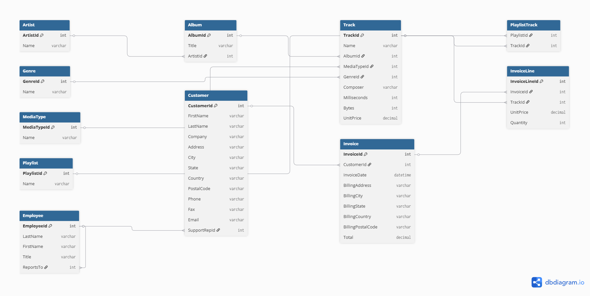

# sales_data_sql_Analytics
SQL analytics project using Chinook and Kaggle Sales datasets — covers core queries, joins, window functions, and query optimization
---

## 📊 Datasets

| Dataset | Source | Records |
|---|---|---|
| Chinook Database | [GitHub – lerocha/chinook-database](https://github.com/lerocha/chinook-database/blob/master/ChinookDatabase/DataSources/Chinook_PostgreSql.sql) | 3,503 tracks, 59 customers, 412 invoices |
| Sample Sales Data | [Kaggle – Sample Sales Data](https://www.kaggle.com/datasets/kyanyoga/sample-sales-data) | 2,823 orders across 7 product lines |
---
## Database Schema

The system is built on a relational model using the Chinook music dataset and a sales dataset.

- invoice_line acts as the fact table for revenue calculations
- track, album, and artist define the product hierarchy

---

## 🛠️ Tools & Technologies

- **Database:** PostgreSQL (hosted on Supabase)
- **Query Interface:** Supabase SQL Editor + pgAdmin 4
- **Language:** SQL

---

## 📝 Skills Covered

### 1. Core SQL Queries
- `SELECT`, `WHERE`, `ORDER BY` — filtering high-value US orders from sales data
- `GROUP BY`, `HAVING`, `SUM` — identifying customers with over $50,000 in total purchases
- `COUNT`, `AVG` — analysing order frequency and average order value per customer

### 2. Joins
- `INNER JOIN` — matching customers to their invoices in Chinook
- `LEFT JOIN` — retaining all customers even without matching invoices
- `RIGHT JOIN` — retaining all invoices even without matching customers
- All three join types returned identical results, confirming clean referential integrity in the Chinook dataset

### 3. Advanced SQL Concepts
- **Subqueries** — identifying the 22 of 59 Chinook customers (37%) who spend above the database average
- **ROW_NUMBER** — assigning unique sequential ranks regardless of ties
- **RANK** — confirmed tie-handling behaviour: a 29-way tie at $37.62 all received rank 29, with the next customer jumping to rank 59
- **PARTITION BY** — ranking tracks by length within each of the 25 genres separately, with rank resetting to 1 at every genre boundary

### 4. Business Problem Solving
- Top artists by revenue: Iron Maiden ($138.60), U2 ($105.93), Metallica ($90.09)
- Top product line: Classic Cars ($3,919,615.66) — more than double the second-highest category
- Revenue trends: sales_data shows strong November seasonality (2003: $1,029,837; 2004: $1,089,048) consistent with pre-holiday buying patterns
- Customer purchasing behaviour: 58 of 59 Chinook customers made exactly 7 purchases each — revealing the synthetic, evenly distributed nature of the dataset

### 5. Query Optimization
- Created indexes on `invoice_line.track_id`, `track.album_id`, and `album.artist_id`
- Used `EXPLAIN ANALYZE` to compare execution plans before and after indexing
- Finding: PostgreSQL's query planner correctly ignored the indexes and continued using sequential scans, since the tables are too small for indexes to provide any benefit — a key real-world insight about when indexing actually helps

---

## 💡 Key Insights

1. **Revenue concentration** — Euro Shopping Channel accounts for $912,294 in sales_data, driven by order frequency (259 orders) rather than order size
2. **Referential integrity** — Chinook's INNER, LEFT, and RIGHT joins all return identical results, confirming no orphaned records exist on either side
3. **Subquery filtering** — 37% of Chinook customers (22 of 59) spend above the database average
4. **Tie behaviour** — RANK skips numbers after ties; ROW_NUMBER never does
5. **Chinook is synthetic** — flat monthly revenue (~$37.62/month for 5 years) and uniform purchase counts (exactly 7 per customer) confirm this is generated test data, not real transactional behaviour
6. **Real seasonality** — sales_data shows genuine November revenue spikes every
