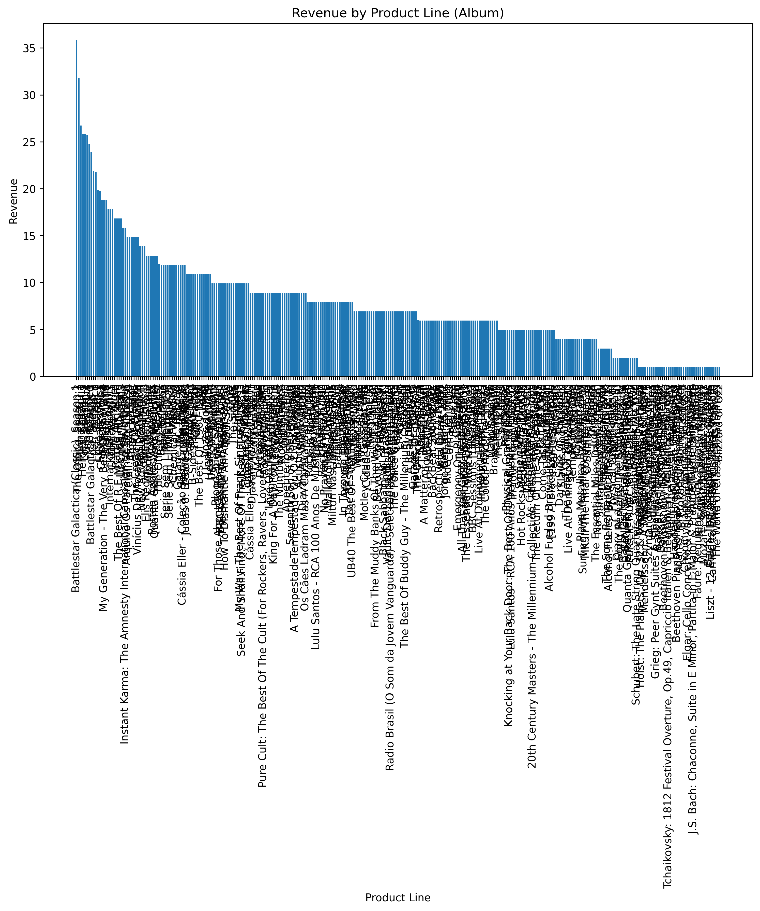

```markdown
# Sales Data SQL Analytics Project

SQL analytics project using the Chinook relational database and a Kaggle sales dataset. The project demonstrates end-to-end SQL analytics skills including data modeling, joins, window functions, and performance evaluation using PostgreSQL (Supabase).

---

## 📊 Datasets

| Dataset | Source | Description |
|---|---|---|
| Chinook Database | GitHub – [lerocha/chinook-database](https://github.com/lerocha/chinook-database) | Music store transactional database containing customers, invoices, tracks, and albums |
| Sample Sales Data | [Kaggle – Sample Sales Data](https://www.kaggle.com/datasets/kyanyoga/sample-sales-data) | E-commerce sales dataset with 2,800+ orders across multiple product lines |

---

## 🧱 Database Schema

The project uses a relational model built on the Chinook dataset and a separate sales dataset.

- invoice_line serves as the FACT table in a star schema design
- track, album, and artist serve as DIMENSION tables supporting product hierarchy analysis
- The schema follows a star-like analytical structure optimized for SQL querying


---

## 📊 Revenue by Product Line

This analysis shows revenue distribution across product lines in the sales dataset.



---

### Key Insight:
Classic Cars is the highest revenue-generating product line, significantly outperforming all other categories.

---

## 🛠️ Tools & Technologies

- **Database:** PostgreSQL (Supabase-hosted)
- **Query Interface:** Supabase SQL Editor, pgAdmin 4
- **Language:** SQL
- **Visualization:** Python (Matplotlib)

---

## 🧠 Skills Demonstrated

### 1. Core SQL Querying
- Filtering and sorting using `SELECT`, `WHERE`, and `ORDER BY`
- Aggregation using `GROUP BY`, `HAVING`, `SUM`, `AVG`, and `COUNT`
- Customer-level and product-level revenue analysis

---

### 2. Table Joins
- `INNER JOIN` for linking customers to invoices in Chinook
- `LEFT JOIN` for retaining all customers regardless of transaction history
- `RIGHT JOIN` for preserving invoice-level completeness
- Consistent join outputs indicate strong referential integrity in the dataset

---

### 3. Advanced SQL Techniques
- **Subqueries:** Identified above-average spenders (22 of 59 customers, ~37%)
- **Window Functions:**
  - `ROW_NUMBER()` for unique ranking
  - `RANK()` to demonstrate tie behavior in revenue distribution
  - `PARTITION BY` to rank tracks within each genre group
- Analysis of ranking logic differences and their business implications

---

### 4. Business Analysis

- **Top Revenue Artists:**
  - Iron Maiden – $138.60
  - U2 – $105.93
  - Metallica – $90.09

- **Top Product Line:**
  - Classic Cars generated $3.9M in revenue, significantly outperforming other categories

- **Seasonality Insights:**
  - Sales dataset shows consistent November peaks across years, indicating strong holiday-driven demand

- **Customer Behaviour:**
  - 58 of 59 Chinook customers made exactly 7 purchases, indicating a structured or synthetic dataset design

---

### 5. Query Optimization & Performance

- Indexes created on:
  - `invoice_line.track_id`
  - `track.album_id`
  - `album.artist_id`

- Performance testing using `EXPLAIN ANALYZE` revealed:
  - PostgreSQL optimizer continued using sequential scans
  - Indexes were not utilized due to small dataset size
  - Demonstrates an important real-world insight: indexing benefits depend on scale and query patterns

---

## 🚀 How to Run This Project

Follow these steps to set up the databases and run the queries yourself.

---

### Prerequisites
- A [Supabase](https://supabase.com) account (free tier is sufficient)
- A web browser (all queries run in the Supabase SQL Editor — no local installation needed)

---

### Step 1 — Create a Supabase Project
1. Go to [supabase.com](https://supabase.com) and sign in
2. Click **New Project**
3. Give it a name (e.g. `week-3-sql-analytics`)
4. Choose a region close to you
5. Set a database password and save it somewhere safe
6. Click **Create new project** and wait ~2 minutes for it to provision

---

### Step 2 — Import the Chinook Database
1. In your Supabase project, go to **SQL Editor** in the left sidebar
2. Click **New Query**
3. Open the file `datasets/Chinook_PostgreSql.sql` from this repository
4. Copy the entire contents and paste into the SQL Editor
5. Click **Run** (this may take 30–60 seconds)
6. Verify it worked by running:

```sql
SELECT COUNT(*) FROM "Track";
-- Expected result: 3503
```

---

### Step 3 — Import the Sales Data (CSV)

**First, create the table:**

```sql
CREATE TABLE sales_data (
  "ORDERNUMBER"       INT,
  "QUANTITYORDERED"   INT,
  "PRICEEACH"         NUMERIC,
  "ORDERLINENUMBER"   INT,
  "SALES"             NUMERIC,
  "ORDERDATE"         TEXT,
  "STATUS"            TEXT,
  "QTR_ID"            INT,
  "MONTH_ID"          INT,
  "YEAR_ID"           INT,
  "PRODUCTLINE"       TEXT,
  "MSRP"              NUMERIC,
  "PRODUCTCODE"       TEXT,
  "CUSTOMERNAME"      TEXT,
  "PHONE"             TEXT,
  "ADDRESSLINE1"      TEXT,
  "ADDRESSLINE2"      TEXT,
  "CITY"              TEXT,
  "STATE"             TEXT,
  "POSTALCODE"        TEXT,
  "COUNTRY"           TEXT,
  "TERRITORY"         TEXT,
  "CONTACTLASTNAME"   TEXT,
  "CONTACTFIRSTNAME"  TEXT,
  "DEALSIZE"          TEXT
);
```

**Then import the CSV:**
1. Go to **Table Editor** in the left sidebar
2. Click on the `sales_data` table
3. Click **Insert** → **Import data from CSV**
4. Upload `datasets/sales_data_sample.csv`
5. Verify it worked by running:

```sql
SELECT COUNT(*) FROM sales_data;
-- Expected result: 2823
```

---

### Step 4 — Run the Queries
1. Open `Week3_SQL_Script.sql` from this repository
2. Copy and paste each section into the Supabase SQL Editor
3. Run them one section at a time to follow the analysis
4. Compare your results against the insights documented in `Week3_SQL_Insights.pdf`

---

### Troubleshooting

| Problem | Solution |
|---|---|
| Chinook import fails | Remove any line starting with `\c` or `DROP DATABASE` before running |
| CSV import shows wrong columns | Make sure you created the table first using the SQL above before importing |
| `relation does not exist` error | Check that the table was created successfully in the Table Editor |
| Slow query execution | Normal on the free Supabase tier — queries still complete within seconds |

---

## 📌 Key Insights

1. Revenue is concentrated in a small number of high-performing artists and product categories, indicating strong skew in distribution.
2. Referential integrity across the Chinook dataset is well maintained, as join operations consistently return complete and consistent results.
3. Window functions provide deeper analytical capabilities beyond standard aggregation, particularly for ranking and segmentation.
4. The Chinook dataset exhibits characteristics of synthetic data, including uniform purchase distribution and consistent transaction patterns.
5. The Kaggle sales dataset shows realistic seasonality effects, particularly recurring Q4 (November) revenue spikes driven by consumer purchasing behavior.

---

## 📈 Project Outcome

This project demonstrates the ability to:
- Design and query relational databases using SQL
- Perform multi-table joins and advanced analytics
- Apply window functions for ranking and segmentation
- Evaluate query performance and indexing behavior
- Extract business insights from structured datasets
```
